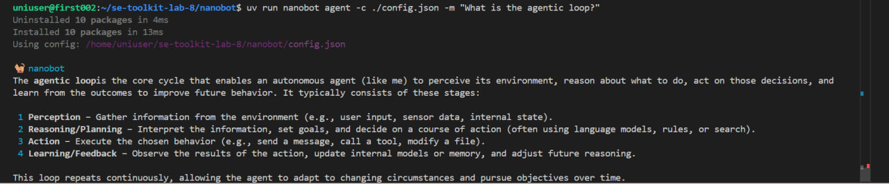
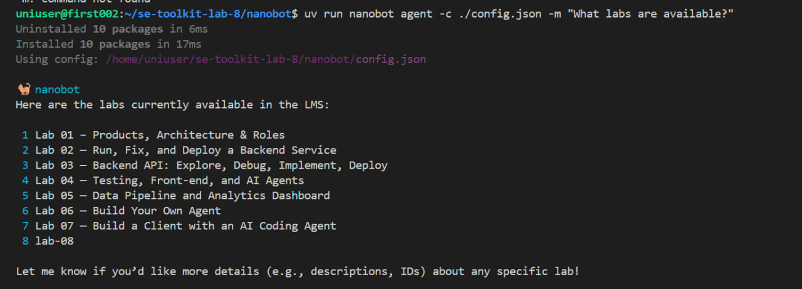
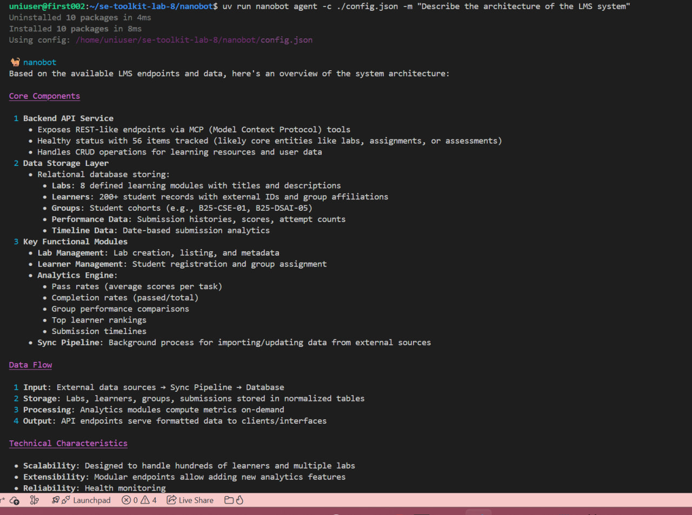
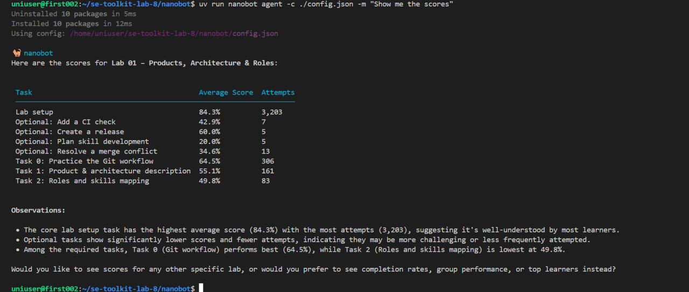

# Lab 8 — Report

Paste your checkpoint evidence below. Add screenshots as image files in the repo and reference them with ``.

## Task 1A — Bare agent

<!-- Paste the agent's response to "What is the agentic loop?" and "What labs are available in our LMS?" -->

### Question 1: "What is the agentic loop?"

### Question 2: "What labs are available in our LMS?"

*Note: The agent does not know about LMS labs because it has no tools configured yet. This is expected behavior for a bare agent.*

## Task 1B — Agent with LMS tools

<!-- Paste the agent's response to "What labs are available?" and "Describe the architecture of the LMS system" -->

### Question 1: "What labs are available?"

*Note: With MCP tools configured, the agent can now call `lms_labs` and return real lab names from the backend.*

### Question 2: "Describe the architecture of the LMS system"

*Note: The agent uses tools like `lms_health` to gather information about the system architecture.*

## Task 1C — Skill prompt

<!-- Paste the agent's response to "Show me the scores" (without specifying a lab) -->

### Question: "Show me the scores" (without specifying a lab)

*Note: The skill prompt teaches the agent to ask which lab when the user doesn't specify one, rather than failing or hallucinating.*

## Task 2A — Deployed agent

<!-- Paste a short nanobot startup log excerpt showing the gateway started inside Docker -->
nanobot-1  | Using config: /tmp/resolved_config.json
  nanobot-1  |  Starting nanobot gateway version 0.1.4.post5 on port 18790...
  nanobot-1  | /usr/local/lib/python3.14/site-packages/dingtalk_stream/stream.py:195: SyntaxWarning: 'return' in a
  'finally' block
  nanobot-1  |   return ip
  nanobot-1  | 2026-04-02 12:26:15.272 | DEBUG    | nanobot.channels.registry:discover_all:64 - Skipping built-in
  channel 'matrix': Matrix dependencies not installed.
  nanobot-1  | 2026-04-02 12:26:16.876 | INFO     | nanobot.channels.manager:_init_channels:58 - WebChat channel enabled
  nanobot-1  | ✓ Channels enabled: webchat
  nanobot-1  | ✓ Heartbeat: every 1800s
  nanobot-1  | 2026-04-02 12:26:16.883 | INFO     | nanobot.heartbeat.service:start:124 - Heartbeat started
  nanobot-1  | 2026-04-02 12:26:17.609 | INFO     | nanobot.channels.manager:start_all:91 - Starting webchat channel...
  nanobot-1  | 2026-04-02 12:26:20.266 | DEBUG    | nanobot.agent.tools.mcp:connect_mcp_servers:226 - MCP: registered
  tool 'mcp_lms_lms_health' from server 'lms'
  nanobot-1  | 2026-04-02 12:26:20.266 | DEBUG    | nanobot.agent.tools.mcp:connect_mcp_servers:226 - MCP: registered
  tool 'mcp_lms_lms_labs' from server 'lms'
  nanobot-1  | 2026-04-02 12:26:20.267 | INFO     | nanobot.agent.tools.mcp:connect_mcp_servers:246 - MCP server 'lms':
  connected, 9 tools registered
  nanobot-1  | 2026-04-02 12:26:20.267 | INFO     | nanobot.agent.loop:run:280 - Agent loop started
  nanobot-1  | 2026-04-02 12:26:52.607 | INFO     | nanobot.agent.loop:_process_message:425 - Processing message from
  webchat:100cf0f0-68cc-472d-90b0-136e75916e2c: hi
  nanobot-1  | 2026-04-02 12:26:55.909 | INFO     | nanobot.agent.loop:_process_message:479 - Response: Hello! I'm
  nanobot, your helpful AI assistant. How can I assist you today?

## Task 2B — Web client

<!-- Screenshot of a conversation with the agent in the Flutter web app -->

## Task 3A — Structured logging

<!-- Paste happy-path and error-path log excerpts, VictoriaLogs query screenshot -->

## Task 3B — Traces

<!-- Screenshots: healthy trace span hierarchy, error trace -->

## Task 3C — Observability MCP tools

<!-- Paste agent responses to "any errors in the last hour?" under normal and failure conditions -->

## Task 4A — Multi-step investigation

<!-- Paste the agent's response to "What went wrong?" showing chained log + trace investigation -->

## Task 4B — Proactive health check

<!-- Screenshot or transcript of the proactive health report that appears in the Flutter chat -->

## Task 4C — Bug fix and recovery

<!-- 1. Root cause identified
     2. Code fix (diff or description)
     3. Post-fix response to "What went wrong?" showing the real underlying failure
     4. Healthy follow-up report or transcript after recovery -->
