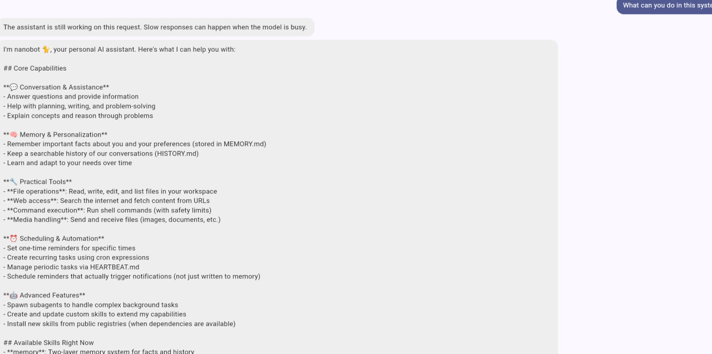

# Lab 8 — Report

Paste your checkpoint evidence below. Add screenshots as image files in the repo and reference them with ``.

## Task 1A — Bare agent

<!-- Paste the agent's response to "What is the agentic loop?" and "What labs are available in our LMS?" -->

### Question 1: "What is the agentic loop?"

### Question 2: "What labs are available in our LMS?"

*Note: The agent does not know about LMS labs because it has no tools configured yet. This is expected behavior for a bare agent.*

## Task 1B — Agent with LMS tools

<!-- Paste the agent's response to "What labs are available?" and "Describe the architecture of the LMS system" -->

### Question 1: "What labs are available?"

*Note: With MCP tools configured, the agent can now call `lms_labs` and return real lab names from the backend.*

### Question 2: "Describe the architecture of the LMS system"

*Note: The agent uses tools like `lms_health` to gather information about the system architecture.*

## Task 1C — Skill prompt

<!-- Paste the agent's response to "Show me the scores" (without specifying a lab) -->

### Question: "Show me the scores" (without specifying a lab)

*Note: The skill prompt teaches the agent to ask which lab when the user doesn't specify one, rather than failing or hallucinating.*

## Task 2A — Deployed agent

nanobot-1  | Using config: /tmp/resolved_config.json
nanobot-1  | 🐈 Starting nanobot gateway version 0.1.4.post5 on port 18790...
nanobot-1  |   Created HEARTBEAT.md
nanobot-1  |   Created AGENTS.md
nanobot-1  |   Created TOOLS.md
nanobot-1  |   Created SOUL.md
nanobot-1  |   Created USER.md
nanobot-1  |   Created memory/MEMORY.md
nanobot-1  |   Created memory/HISTORY.md
nanobot-1  | /usr/local/lib/python3.14/site-packages/dingtalk_stream/stream.py:195: SyntaxWarning: 'return' in a 'finally' block     
nanobot-1  |   return ip
nanobot-1  | 2026-03-31 15:32:42.950 | DEBUG    | nanobot.channels.registry:discover_all:64 - Skipping built-in channel 'matrix': Matrix dependencies not installed. Run: pip install nanobot-ai[matrix]
nanobot-1  | 2026-03-31 15:32:44.751 | INFO     | nanobot.channels.manager:_init_channels:58 - WebChat channel enabled
nanobot-1  | ✓ Channels enabled: webchat
nanobot-1  | ✓ Heartbeat: every 1800s
nanobot-1  | 2026-03-31 15:32:44.754 | INFO     | nanobot.cron.service:start:202 - Cron service started with 0 jobs
nanobot-1  | 2026-03-31 15:32:44.754 | INFO     | nanobot.heartbeat.service:start:124 - Heartbeat started (every 1800s)
nanobot-1  | 2026-03-31 15:32:45.635 | INFO     | nanobot.channels.manager:start_all:91 - Starting webchat channel...
nanobot-1  | 2026-03-31 15:32:45.636 | INFO     | nanobot.channels.manager:_dispatch_outbound:119 - Outbound dispatcher started      
nanobot-1  | /usr/local/bin/python: No module named mcp_lms
nanobot-1  | 2026-03-31 15:32:45.674 | ERROR    | nanobot.agent.tools.mcp:connect_mcp_servers:248 - MCP server 'lms': failed to connect: Connection closed
nanobot-1  | 2026-03-31 15:32:45.675 | INFO     | nanobot.agent.loop:run:280 - Agent loop started
nanobot-1  | 2026-03-31 15:34:37.769 | INFO     | nanobot.agent.loop:_process_message:425 - Processing message from webchat:f2152dce-aef4-467b-b030-e09c23446901: hello
nanobot-1  | 2026-03-31 15:34:51.747 | INFO     | nanobot.agent.loop:_process_message:479 - Response to webchat:f2152dce-aef4-467b-b030-e09c23446901: Hello! I'm nanobot🐈, your helpful AI assistant. How can I assist you today?
nanobot-1  | 2026-03-31 15:35:16.554 | DEBUG    | nanobot.agent.memory:maybe_consolidate_by_tokens:323 - Token consolidation idle webchat:f2152dce-aef4-467b-b030-e09c23446901: 3792/65536 via tiktoken
nanobot-1  | 2026-03-31 15:36:43.310 | INFO     | nanobot.agent.loop:_process_message:425 - Processing message from webchat:9db71d52-730a-44ce-9683-df4ec797c69a: What can you do in this system?
nanobot-1  | 2026-03-31 15:36:50.012 | INFO     | nanobot.agent.loop:_prepare_tools:253 - Tool call: list_dir({"path": "/app/nanobot/workspace"})
nanobot-1  | 2026-03-31 15:36:57.250 | INFO     | nanobot.agent.loop:_prepare_tools:253 - Tool call: read_file({"path": "/app/nanobot/workspace/SOUL.md"})
nanobot-1  | 2026-03-31 15:37:12.909 | INFO     | nanobot.agent.loop:_prepare_tools:253 - Tool call: read_file({"path": "/app/nanobot/workspace/AGENTS.md"})
nanobot-1  | 2026-03-31 15:37:24.015 | INFO     | nanobot.agent.loop:_prepare_tools:253 - Tool call: list_dir({"path": "/app/nanobot/workspace/skills"})
nanobot-1  | 2026-03-31 15:37:31.375 | INFO     | nanobot.agent.loop:_prepare_tools:253 - Tool call: list_dir({"path": "/app/nanobot/workspace/skills/lms"})
nanobot-1  | 2026-03-31 15:37:33.146 | INFO     | nanobot.agent.loop:_prepare_tools:253 - Tool call: list_dir({"path": "/app/nanobot/workspace/memory"})
nanobot-1  | 2026-03-31 15:38:23.910 | INFO     | nanobot.agent.loop:_process_message:479 - Response to webchat:9db71d52-730a-44ce-9683-df4ec797c69a: I'm nanobot 🐈, your personal AI assistant. Here's what I can help you with:
nanobot-1  |
nanobot-1  | ## Core Capabilities
nanobot-1  |
nanobot-1  | **💬 Conversation & As...
nanobot-1  | 2026-03-31 15:38:23.927 | DEBUG    | nanobot.agent.memory:maybe_consolidate_by_tokens:323 - Token consolidation idle webchat:9db71d52-730a-44ce-9683-df4ec797c69a: 5063/65536 via tiktoken

## Task 2B — Web client

 

## Task 3A — Structured logging

<!-- Paste happy-path and error-path log excerpts, VictoriaLogs query screenshot -->

## Task 3B — Traces

<!-- Screenshots: healthy trace span hierarchy, error trace -->

## Task 3C — Observability MCP tools

<!-- Paste agent responses to "any errors in the last hour?" under normal and failure conditions -->

## Task 4A — Multi-step investigation

<!-- Paste the agent's response to "What went wrong?" showing chained log + trace investigation -->

## Task 4B — Proactive health check

<!-- Screenshot or transcript of the proactive health report that appears in the Flutter chat -->

## Task 4C — Bug fix and recovery

<!-- 1. Root cause identified
     2. Code fix (diff or description)
     3. Post-fix response to "What went wrong?" showing the real underlying failure
     4. Healthy follow-up report or transcript after recovery -->
